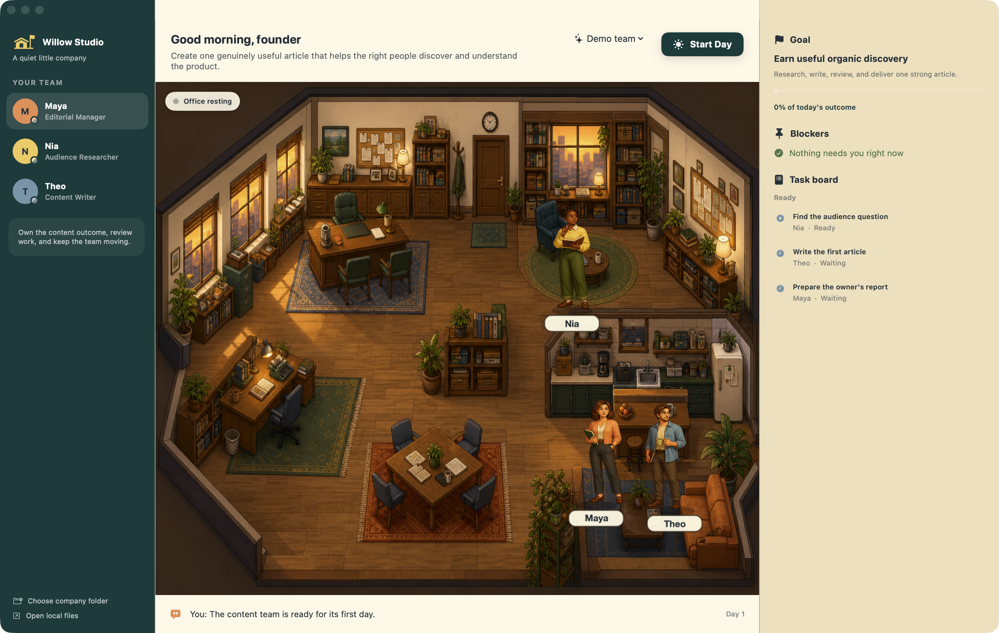

# Agent Office

`Agent Office` is the temporary development name for a native Mac proof of
concept: a cosy local workplace where an owner gives a small team of AI
employees an outcome, starts the day, watches their handoffs, and inspects the
work they leave behind.



## Run it

Requirements: macOS 14 or newer and Xcode 16 or a compatible Swift 6.1
toolchain.

```bash
swift run AgentOffice
```

To build a normal local Mac application bundle with its SwiftPM image resources
embedded and an ad-hoc signature applied:

```bash
./scripts/package-app.sh
open dist/AgentOffice.app
```

Pass `debug` to the packaging script for a debug bundle. The default build is
ad-hoc signed for local verification. A direct-distribution build can provide
the complete personal Developer ID certificate name through
`AGENT_OFFICE_SIGNING_IDENTITY`; the script then enables hardened runtime and a
trusted timestamp. `AGENT_OFFICE_DISPLAY_NAME` and `AGENT_OFFICE_BUNDLE_ID`
allow the temporary Office OS identity without renaming the Swift package.

`scripts/notarize-app.sh` fails closed unless the bundle has a Developer ID
Application signature and `AGENT_OFFICE_NOTARY_PROFILE` names an existing
`notarytool` Keychain profile. Neither helper publishes the app or creates a
store record. Updates and final release packaging remain outside this POC.

The first launch creates a fresh Willow Studio organization under:

```text
~/Library/Application Support/AgentOffice/WillowStudioPOC
```

Choose **company folder** in the app to create or reopen a different local
organization. Selecting an empty folder seeds a fresh team.

## What works

- Start and end a workday without losing progress.
- Set up the human owner, receive Mira as a paired executive assistant, and
  give the team a real product brief.
- Have Maya own a bounded outcome while Nia and Theo research, write, review,
  revise, and report.
- Select any AI employee in the Office and give them a free-form outcome. The
  employee chooses from their assigned skills, creates one to four canonical
  Mission tickets, works through them in sequence, communicates progress, and
  either delivers local Markdown artifacts or asks the owner for precise help.
- Give Nia one free-form research outcome from the **Research desk**. Mira
  delegates it, Nia produces the brief, and Mira leaves an evidence-labelled
  delivery note for the owner.
- Retry an interrupted or failed research assignment, resume it after granting
  read-only web research, and reopen the company without losing its state.
- Give Iris one durable **Customer Voice Weekly** responsibility. Drop `.txt`,
  `.md`, or `.csv` feedback into the company-owned local inbox, run the duty
  while the app is open, and receive one source-labelled owner decision through
  Mira.
- Stop or retry the same weekly occurrence without advancing its due date;
  delivered occurrences advance by one week and remain inspectable in
  `DUTIES.md`.
- Inspect goals, blockers, tasks, activity, and employee-authored Markdown.
- Grant or revoke Nia's read-only web research capability and inspect its use.
- Open each AI employee's local identity, responsibilities, memory,
  capabilities, and artifact index.
- Open the **Company Library** to inspect the employee catalogue, exact skill
  coverage, coverage gaps, and recognized local connections.
- Teach an organizational skill to one employee, or assign an existing skill
  to another employee. Taught skills are versioned local operating guidance
  included in that employee's future Local Codex work; they do not fine-tune
  or certify the underlying model.
- Inspect the organization-wide `SKILLS.md`, `CONNECTIONS.md`,
  `EMPLOYEE_OUTCOMES.md`, `RESEARCH_ASSIGNMENTS.md`, and `DUTIES.md`
  projections, plus each AI
  employee's assigned `SKILLS.md`.
- Use the deterministic **Demo team**, which needs no account or network.
- Optionally choose **Local Codex** when the authenticated Codex CLI is
  installed. Its process is ephemeral and read-only; the app stores no API key.

## POC boundaries

The initial team and roles are seeded. The organization can run one employee
assignment at a time: the bounded content workday, a free-form employee
outcome, owner-directed research, or Iris's explicitly started weekly duty.
Free-form outcomes use only skills and permissions already assigned to the
employee; they cannot publish, spend, or create new capabilities. The due date
is durable, but there is no background
wake or execution while the app is closed. There is no marketplace, cloud sync,
publishing integration, onboarding for additional humans, or generic
production permission system yet. Connections are recognized local
capabilities, not Composio or OAuth account setup. Teaching is prompt-level
organizational guidance, not model training. The current character animation
is also not the approved final direction; a coherent 2D character system
remains open in the Mac POC issue.

The first real Local Codex employee field test is preserved under
`artifacts/field-tests/2026-08-09-first-live-run/`. Nia delivered a cited brief
in one attempt; that evidence directly shaped Iris and her first recurring
duty.

The future employee marketplace is tracked in
[issue #1](https://github.com/sass-maker/agent-office/issues/1).

## Preview the landing page

The marketing page is dependency-free and uses the real application artwork:

```bash
python3 -m http.server 4173 --directory site
```

Open `http://localhost:4173`.

The intended commercial model is explicit on the page: the Mac workplace is a
one-time purchase, while optional employees may be separate subscriptions.
Prices, checkout, and the employee marketplace are not live.
