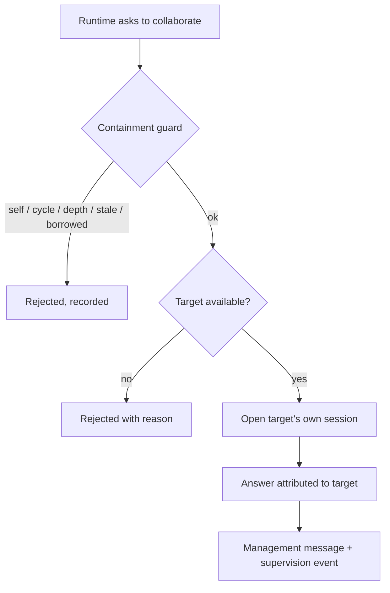

## Context

Office OS already owns the primitives this needs: employees with contracts and
grants (#existing), a driver seam and bindings (#25), and an enforcement point
for what a runtime may do (#26). What is missing is the bridge — and the bridge
is where an agent system usually goes wrong, by growing a second task model, a
free-form chat product, or an unbounded call graph.

## Goals / Non-goals

**Goals**
- Reuse existing communication and delegation records; add no parallel work graph.
- Make a proposal a proposal: review stays where it already is.
- Contain depth, cycles, budgets, and borrowed permissions deterministically.

**Non-goals**
- Multi-hop graphs. One hop, deliberately.
- Any autonomy over hiring, grants, contracts, or accountability.

## Decisions

### The target runs itself

A collaboration does not execute the source employee's session against another
employee's work. The broker resolves the *target's* binding, opens the *target's*
session, and authorizes with the *target's* contract. That is what makes
"employees have their own authority" true at runtime rather than by convention.

### Proposals never mutate

`proposeDelegation` writes a management message and a supervision event. It does
not call `reassignTicket`. The owner's existing flow does, which keeps review
policy authoritative and makes the proposal auditable whether or not it is
accepted.

### Containment is checked before anything runs

Self-call, cycle, depth, duplicate correlation, expired deadline, borrowed
capabilities, and target availability are evaluated first, in one guard, so a
rejected collaboration never opens a session or spends a turn.

### The chain travels with the request

Depth and cycles are decided from a `chain` of employee identifiers carried on
the request rather than from broker-side bookkeeping, so a lost or restarted
broker cannot forget that a call is already two deep.

## Risks / Trade-offs

- **One hop is restrictive.** A consultation cannot itself consult. That is the
  intended starting point; the issue asks for deeper graphs to be designed
  separately rather than emerging by accident.
- **Proposals need a human.** A delegation proposal sits until someone acts. The
  alternative — letting a runtime move accountability — is the thing this is
  built to prevent.
