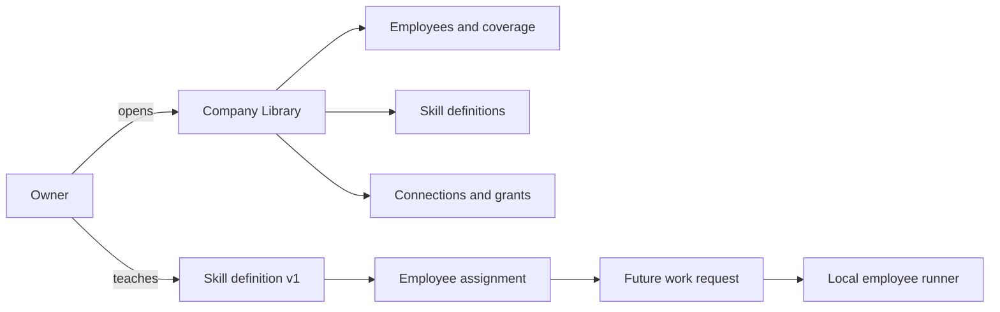

## Context

See `proposal.md` for motivation. The current schema stores employee identity, free-text responsibility, capability grants, memory, and work artifacts, but the content workflow infers operating knowledge from hard-coded roles and operations. The Mac app must remain dependency-free, local, inspectable, and safe for existing version-three organization files.

## Goals / Non-Goals

**Goals:**

- Make employee, skill, and connection coverage legible in one native library.
- Give skills stable identity and versioning independent of employees and models.
- Make owner-taught guidance alter future execution context immediately.
- Preserve local files, current permissions, and backward compatibility.

**Non-Goals:**

- Skill marketplace, downloads, remote registry, billing, ratings, or creator accounts.
- Composio, OAuth, credential entry, external writes, or generic integration execution.
- Model fine-tuning, automated skill verification, eval promotion, or self-improvement.
- Hiring/removing employees, editing hierarchy, or rebuilding the 2D character system.

## Decisions

### Separate skill definitions from employee assignments

`SkillDefinition` stores reusable knowledge: identity, name, category, purpose, instructions, success criteria, version, source, required connection identifiers, authorship, and timestamps. `EmployeeSkillAssignment` links an employee to a skill and records who taught or assigned it and when.

This avoids copying instruction text into every employee and makes coverage queries exact. A single `[String]` on `Employee` was rejected because it cannot carry version, provenance, success criteria, or assignment history.

### Store catalogues inside organization knowledge

Skill definitions, assignments, and connection definitions live in the existing organization-owned knowledge boundary and are encoded into `organization.json`. Version-four migration merges missing built-ins by stable identifier and never replaces an existing definition or assignment.

A global application catalogue was deferred because the first requirement is organization-local inspectability. A future marketplace can import definitions into this boundary.

### Treat teaching as prompt-level operating guidance

The work engine resolves the assigned skill definitions for the active employee and places them on `EmployeeWorkRequest`. Deterministic work remains deterministic; Local Codex receives a clearly delimited organizational-skills section containing purpose, instructions, success criteria, and version.

This is honest and immediately useful. Fine-tuning was rejected because the application does not yet produce training data, evals, or a model lifecycle.

### Represent connections as definitions plus derived local status

The persisted catalogue names recognized connections and the capability identifier they gate. Runtime availability is derived by the app: Demo is available, Local Codex depends on local discovery, and Web Research combines runtime availability with employee grants. No tokens or credentials enter the catalogue.

### Add one preserved-language Company Library sheet

The workplace gains a Library control that opens a warm native sheet with a compact Employee/Skills/Connections switcher. Employee and skill lists share a master-detail composition. Teaching uses a focused form sheet, not a workflow canvas or enterprise integration grid.

## Risks / Trade-offs

- [Prompt instructions do not prove competence] → Label taught skills as owner-taught guidance and avoid verification claims.
- [Built-in seed changes could overwrite owner edits] → Merge only missing stable identifiers during migration.
- [Large skill text can bloat prompts] → Keep the initial form bounded and include only skills assigned to the active employee.
- [Connection catalogue may imply integrations exist] → Show recognized local access only and explicitly label unavailable or permission-gated states.
- [Another large modal could feel corporate] → Reuse the folio, shelf, and key-cupboard language with a compact native master-detail layout.

## Migration Plan

1. Decode existing optional catalogue fields as absent.
2. Raise the schema to version four and merge missing built-in skills, assignments, and connections by stable identifier.
3. Save the migrated organization and materialize `SKILLS.md` plus updated employee `SKILLS.md` files.
4. Rollback remains possible by ignoring the additional optional fields; no existing artifact path is removed or rewritten.
