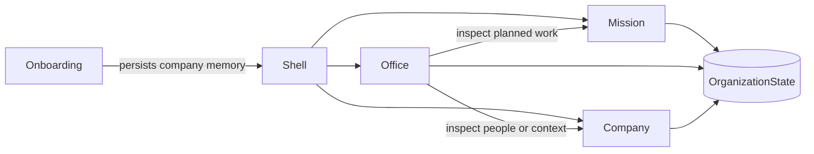

## Context

See `proposal.md` for motivation. The application currently switches directly from onboarding to `OrganizationHomeView`. That view already owns a polished SpriteKit office, employee selection, owner trays, workday controls, Company Library sheets, research, Customer Voice, and artifact access. `OrganizationState` persists locally and already holds employees, goals, tasks, blockers, artifacts, activity, and optional `OrganizationKnowledge`.

The implementation must preserve existing local organizations and keep the office visually dominant without asking one screen to present every durable concept.

## Goals / Non-Goals

**Goals:**

- Introduce one native shell that owns destination selection and shared company identity.
- Make the current organization home the Office destination with only small links to detailed work and company memory.
- Build useful Mission and Company destinations from existing real state.
- Add structured company profile data with tolerant decoding and a deterministic legacy migration.
- Keep one source of truth for members, skills, connections, tasks, blockers, and artifacts.

**Non-Goals:**

- Multiple organizations in one window, cloud sync, human invitations, employee marketplace, arbitrary task editing, or generalized permissions.
- Replacing SpriteKit, changing employee execution, redesigning Company Library internals, or inventing new backend infrastructure.
- Rasterizing native controls or text, copying the concept comp literally, or changing product behavior to manufacture a more dramatic demo.

## Decisions

### One shell owns three destination states

Add a SwiftUI `OrganizationShellView` with an internal `OrganizationDestination` enum. The shell renders one full-height black destination sidebar and one content surface at a time. Keyboard shortcuts map Command-1, Command-2, and Command-3 to Office, Mission, and Company.

This keeps navigation state out of the durable organization model: destination selection is application UI state, not company knowledge. The sidebar is an intentionally authored Mac navigation surface rather than a generic enterprise split view. There is no global top bar or bottom bar; workday control lives at the foot of the same sidebar.

### Structured profile lives inside OrganizationKnowledge

Add a Codable `OrganizationProfile` to `OrganizationKnowledge` rather than expanding the top-level state with many optional strings. Decode it with a safe default so older JSON remains readable. Bump the schema version and let the existing persistence migration seed missing values from organization name, outcome, and product brief.

The profile owns purpose, product, audience, stage, operating principles, and constraints. The existing product brief remains the execution document for employees; saving profile edits also refreshes a readable product brief projection so the two do not silently diverge.

### Mission is a projection, not another task database

`MissionView` derives four grouped list sections from existing `TaskStatus` values:

- In progress: doing, revision
- Review: review
- Next: waiting, ready, blocked
- Delivered: done

The view adds no drag-and-drop or direct status mutation. Workday and employee engines continue to own transitions. Compact rows expose a stable task key, assignee, state, due context, and artifact presence. Selection opens a native task inspector with outcome, owner, reviewer, blocker, artifact, and attributable activity. Filters change only presentation.

### Company composes focused native sections

`CompanyView` provides Overview, Members, Skills, and Connections sections. Overview edits profile fields through one explicit save action. Members derives directly from `organization.employees`. Skills and Connections reuse `CompanyLibraryView` content through an initial-section parameter rather than copying catalogue logic.

Members are presented as a warm editorial relationship wall. Selecting a member opens an `EmployeeDetailsView` inside Company. That page composes current organization state rather than introducing a profile database: identity, responsibility, manager and reports, current outcome and tasks, assigned skills, artifacts, blockers, and activity all come from existing models.

### Onboarding becomes profile-first but stays bounded

The wizard remains five concise stages: welcome, organization, product, mission, and opening the office. Its approved composition is a split canvas with a quiet vertical step spine, warm native paper-line fields, and an illustrated office preview. Large free-form fields remain available for principles and constraints, but the owner can complete the prepared office path without fabricated claims.

### Editorial Office replaces Dawn Stage

The owner approved five final references after rejecting the cream-and-walnut and Dawn Stage lanes. Editorial Office is the replacement contract:

- **Thesis:** the company is a living illustrated office for people, while operational pages become quiet, serious native software.
- **World:** ink black, warm bone, soft grey, graphite, and restrained silver; expressive faces and simple black clothing; paper folios and thin rules rather than decorative dashboard cards.
- **Shell:** one full-height black sidebar with Office, Mission, Company, and workday control; no global top or bottom bar.
- **Office:** an almost edge-to-edge editorial workplace. Selecting a person opens one floating employee folio over the scene without resizing it.
- **Mission:** a Linear-inspired grouped native list with filters, compact rows, and a contextual task inspector, adapted into the ink-and-paper world.
- **Company:** a member relationship wall, quiet company-memory pages, and a full Employee Details surface reached from Members or the Office folio.
- **Onboarding:** a bright split setup scene where the organization form and the office being prepared share one composition.

The approved references live at `artifacts/design/approved/editorial-office/`. They are quality, composition, and density references rather than screenshots to trace. Generated raster is limited to illustration and portrait assets; functional text, controls, focus, keyboard access, and state remain native.

## Risks / Trade-offs

- **[Risk] Structured profile and product brief can diverge** → Use one model save method that updates both and test the resulting local projection.
- **[Risk] Three destinations feel like conventional tabs pasted onto a game** → Use one shared ink sidebar with identical geometry and typography across every destination; keep the Office scene unobstructed.
- **[Risk] Mission duplicates Office state** → Limit Office to people, current duty, and contextual folios; Mission owns the full hierarchy and task list.
- **[Risk] Existing state fails decoding after schema changes** → Use `decodeIfPresent`, deterministic defaults, and persistence round-trip migration tests.
- **[Risk] Company Library reuse is difficult because it is sheet-shaped** → Add a lightweight initial-section API first; refactor only the minimum container code needed for embedded access.
- **[Risk] The redesign becomes a dark dashboard with decorative illustration** → Restrict black to the sidebar, type, structure, portraits, and clothing; keep large working surfaces warm and quiet.
- **[Risk] Linear inspiration erases product identity** → Borrow list density, grouping, filtering, selection, and inspection only; preserve the Editorial Office palette, typography, portraits, and product-specific fields.
- **[Risk] The comp promises more asset fidelity than the implementation** → Use the approved references as a ceiling, author the required illustration assets, and preserve semantic UI instead of filling gaps with generic cards.

## Migration Plan

1. Decode missing structured profiles as empty/default values.
2. During existing state migration, seed organization name, outcome, and available product-brief context without overwriting owner-authored text.
3. Persist the upgraded schema through the existing local store.
4. Keep rollback data-compatible by leaving all prior top-level and knowledge fields intact.
