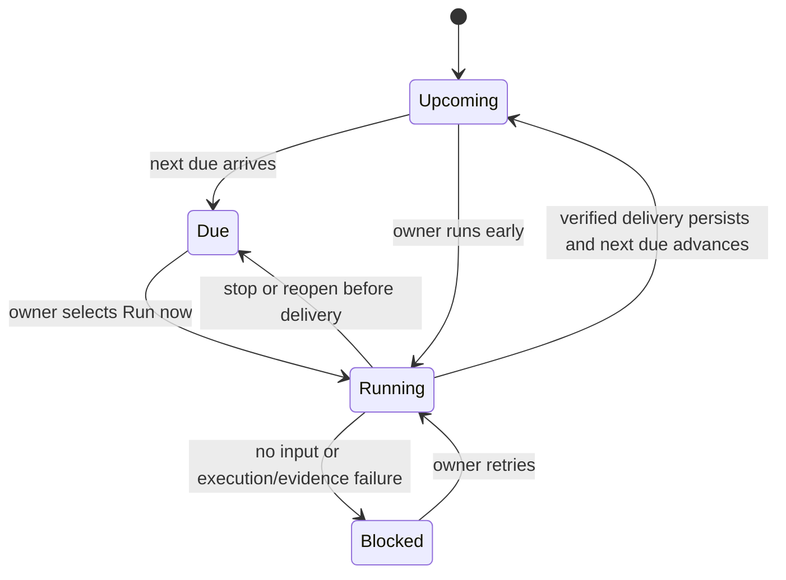

## Context

The current application has durable named employees, a single cancellable work
boundary, Local Codex and deterministic runners, local organization storage,
artifact projections, and one owner-directed research engine. The first live
research run delivered a cited recommendation for a local Customer Voice
Analyst. See `proposal.md` for motivation and
`specs/recurring-employee-duty/spec.md` for observable behavior.

The implementation must preserve the employee/model/skill/permission
distinctions, the existing content workday and research assignment, and the
cosy native workplace. It cannot depend on background launch agents, cloud
credentials, or third-party packages.

## Goals / Non-Goals

**Goals:**

- Prove that an employee can own the same useful duty across successive weeks.
- Keep local input scope, evidence, run state, and next occurrence inspectable.
- Reuse the current execution and cancellation boundaries without turning them
  into a generic orchestration framework.
- Make the due duty visible and operable from the existing Mac home.

**Non-Goals:**

- Automatic execution while the app is closed.
- Arbitrary recurrence rules, dependencies, workflows, or user-authored agents.
- Live support, CRM, analytics, email, calendar, or publishing connections.
- PII detection, semantic deduplication, or customer-contact automation.

## Decisions

### Hard-code one employee and one duty

Add Iris and `customer-voice-weekly` through migration-aware seeded definitions.
Store a small duty record and occurrence history in organization knowledge.
This proves durable responsibility without prematurely creating an agent DSL or
generic scheduler. The alternative—a configurable employee/duty builder—would
add abstraction before one repeated duty is useful.

### Treat the inbox as an organization-owned capability boundary

The store owns a `feedback-inbox/` directory and exposes a bounded scanner that
accepts only direct regular files with supported extensions, rejects symlinks,
sorts paths deterministically, and caps both file count and bytes. The engine
passes the captured snapshot into the employee request rather than granting the
model arbitrary filesystem exploration. An arbitrary system folder picker was
rejected because the selected organization is already the POC's explicit local
boundary.

### Reuse EmployeeRunner with a customer-voice operation

Add one focused operation and prompt contract. Local Codex receives labelled
input excerpts with no web permission; Demo receives the same snapshot but
returns explicitly synthetic analysis. A dedicated duty engine owns input
scanning, state transitions, verification, artifacts, next-due advancement,
and recovery. Folding this into the content workday was rejected because it
would couple two independent owner outcomes.

### Persist an occurrence before and after execution

`AppModel` creates and saves the running occurrence before invoking the runner,
then accepts a terminal result only when its session remains current and the
terminal save succeeds. Reopen migration resets `running` to resumable. The due
date advances only with persisted delivery.

### Add one compact native duty folio

Use the preserve design lane. A pinned-paper duty card shows Iris, the weekly
responsibility, next due, input coverage or blocker, `Add feedback`, `Run now`,
and the latest brief. Running and delivered states reuse existing employee,
artifact, and status language. It must not resemble a cron editor or HR form.

## Risks / Trade-offs

- **Sensitive feedback is placed locally** → Explain the deliberate inbox
  boundary, never scan elsewhere, and avoid external research for this duty.
- **Large or malformed exports can consume excessive context** → Enforce file
  and byte caps before model execution and report exclusions.
- **Weekly dates can be surprising across time zones** → Store absolute dates,
  calculate the next occurrence with the user's current calendar, and display a
  local date rather than promising background timing.
- **A model can cite labels without supporting its claim** → Require valid
  labels and expose source files; deeper claim verification remains future work.
- **The fixed employee may not fit pre-customer founders** → Keep the duty
  optional and runnable only when the owner supplies feedback.

## Migration Plan

1. Decode older organization knowledge with empty duty defaults.
2. Add Iris, her built-in skill, and the weekly duty only when their stable IDs
   are absent.
3. Create the inbox and projections during the next ordinary store save.
4. Preserve rollback compatibility by keeping all new decoded fields optional
   with defaults; older builds are not expected to preserve unknown new data.
