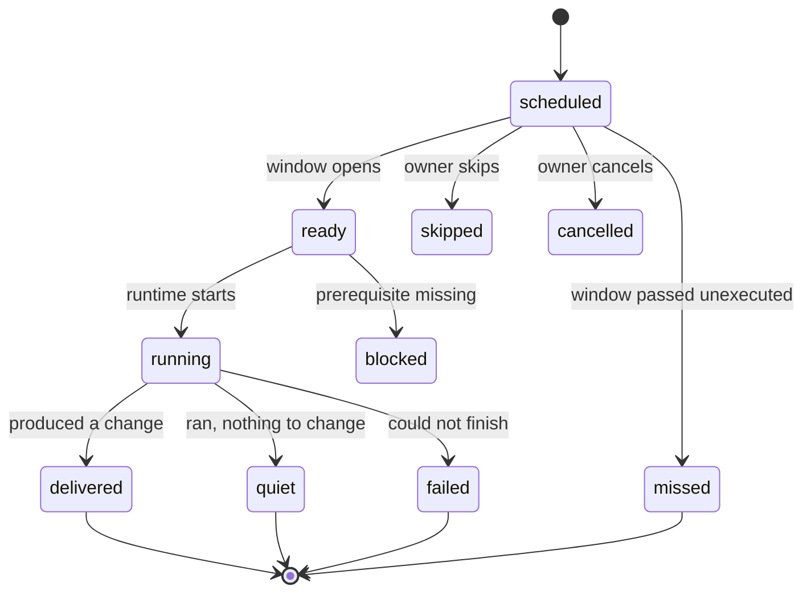

## Context

Iris's weekly duty already carries a next-due date and an explicitly started
occurrence. That is one bespoke temporal path for one duty. There is no durable
occurrence record, no separation of planned from actual, and nothing that can
tell the owner whether a run happened, found nothing, or never started.

## Goals / Non-goals

**Goals**
- Occurrences as durable, deterministic records pointing at existing work.
- Planned and actual kept apart, so reserved time never implies work.
- A receipt that can say "ran, changed nothing" without sounding like failure.

**Non-goals**
- The calendar surface, catch-up policy UI, capacity placement, and approval
  projection — later slices of #24.
- Background execution of any kind.

## Decisions

### Occurrence identity is derived, not generated

An occurrence's identifier is its policy identifier plus its scheduled instant.
Generating occurrences is therefore idempotent: a restart, a retry, a clock
change, or a timezone change re-derives the same identifiers instead of creating
a second occurrence for the same instant. This is the single most important
property here — duplicate scheduled work is the failure mode that would make the
whole feature unsafe.

### Quiet is a first-class result

`quiet` means the run executed and found nothing to change. It is deliberately
separate from `failed`, from an empty artifact, and from `missed`, which means
nothing ran at all. Collapsing these is how a scheduler starts lying to its
owner.

### Usage is a three-valued fact

`observed`, `unknown`, or `notApplicable`. A runtime that reports nothing yields
`unknown`, never zero, because zero is a claim.

### Reconciliation never executes

Reopening after a missed window marks it missed. It does not run the work late.
Whether to catch up is an owner-authored policy, which is a later slice; until
then the honest state is missed.

## Risks / Trade-offs

- **Occurrence volume.** A recurring policy generates one record per instant
  within the horizon it is asked for. Generation is bounded by an explicit
  horizon rather than open-ended, and pruning is left to a later slice rather
  than guessed at now.
- **No execution yet.** This slice records intent and outcome; wiring occurrences
  to actually dispatch work belongs with the runtime-presence slice, so the
  states here are written by whatever executes, not by the scheduler itself.
