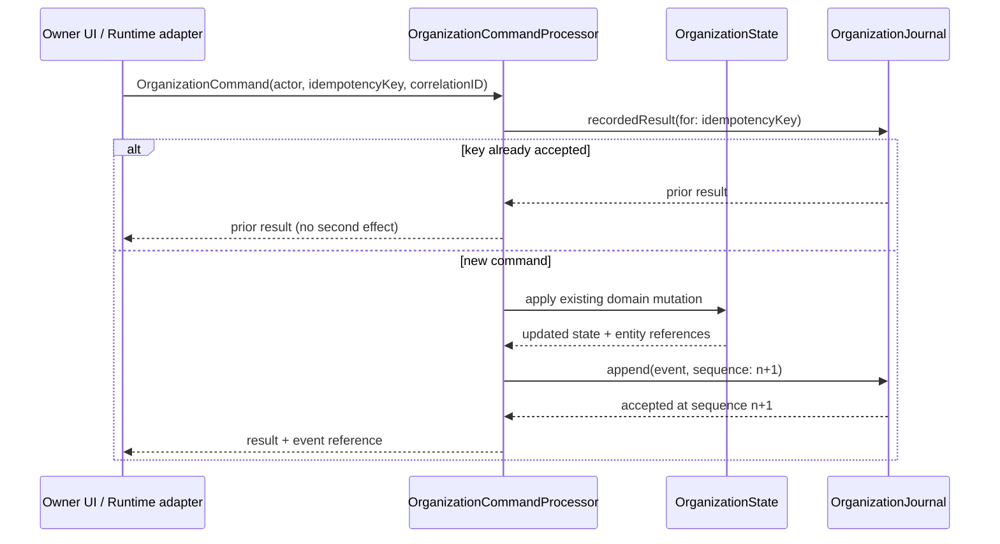

## Context

`OrganizationState` is a single `Codable` value type persisted as one snapshot
file. Every mutation today is a `mutating func` on that value called directly
from `AppModel`, followed by `persistSoon()`. Activity entries are appended by
hand next to each mutation, which is why history is partial and unattributed.

The substrate must not replace that model. Snapshot-first persistence is what
makes the app fast and inspectable, and the existing mutating functions carry
the organization's real validation rules. The command layer wraps them.

## Goals / Non-goals

**Goals**
- One typed entry point for consequential change, usable by the UI today and by
  runtime adapters later.
- History that reconstructs state deterministically, not prose that describes it.
- Duplicate-safe retries, because runtimes retry.
- Visible failure on corrupt history.

**Non-goals**
- Event sourcing as the primary read path. The snapshot stays authoritative for
  reads; the journal is authoritative for *history*.
- Distributed consistency. This is a local, single-writer store.

## Decisions

### Snapshot stays primary, journal is append-only history

Rebuilding state from events on every launch would be slower and riskier than
what exists. Instead `save` writes the snapshot as it does today and records
the snapshot's `journalSequence`. Replay is a verification and inspection tool:
given a snapshot at sequence *n* and events *n+1…m*, it produces the state at
*m*. This satisfies "deterministic reconstruction" without betting the app's
startup path on it.

### JSONL, appended atomically

One event per line in `journal.jsonl`. Appending is a single `write` at the end
of the file through a file handle, so a crash can only truncate the final line —
which the reader detects and reports rather than skipping. A rewrite-the-world
format (single JSON array) would make every append O(file) and risk losing the
whole history on a partial write.

### Idempotency keys live in the journal, not in state

Each command carries an `idempotencyKey`. Before applying, the processor asks
the journal whether that key was already accepted; if so it returns the recorded
outcome unchanged. Keeping the key index out of `OrganizationState` means
retry-safety cannot drift from history, and no existing model type changes shape.

### Commands wrap existing mutating functions

`OrganizationCommand` is an enum whose handlers call the same
`createEmployeeOutcome` / `recordDelivery` functions the UI calls today. The
command layer owns attribution, ordering, idempotency, and event emission; the
domain functions keep owning validation. This is what keeps the change small
enough to review and prevents a second, divergent rule set.

### Deterministic ordering

Events carry a monotonically increasing `sequence` assigned by the journal under
the store actor, plus a wall-clock `occurredAt` for display. Ordering is by
sequence, never by timestamp, so clock changes cannot reorder history.

## Flow

## Risks / Trade-offs

- **Journal growth.** One line per consequential transition. At the scale of a
  single local organization this is small, and truncation/compaction is a later
  concern. Recorded as a follow-up rather than solved speculatively.
- **Partial coverage.** Only two transitions route through commands in this
  change, so history is intentionally incomplete until later slices land. The
  journal records its own schema version so later event types are additive.
- **Replay equivalence is only as good as its fixture.** The test compares the
  full `OrganizationState` value after replay against the directly-mutated
  state, so any field a handler forgets to reproduce fails the test.

## Migration

Existing organizations have no journal. On first accepted command the journal is
created with a header line carrying its format version and the snapshot sequence
it starts from. No existing file is rewritten, so downgrading simply leaves an
unread `journal.jsonl` behind.
