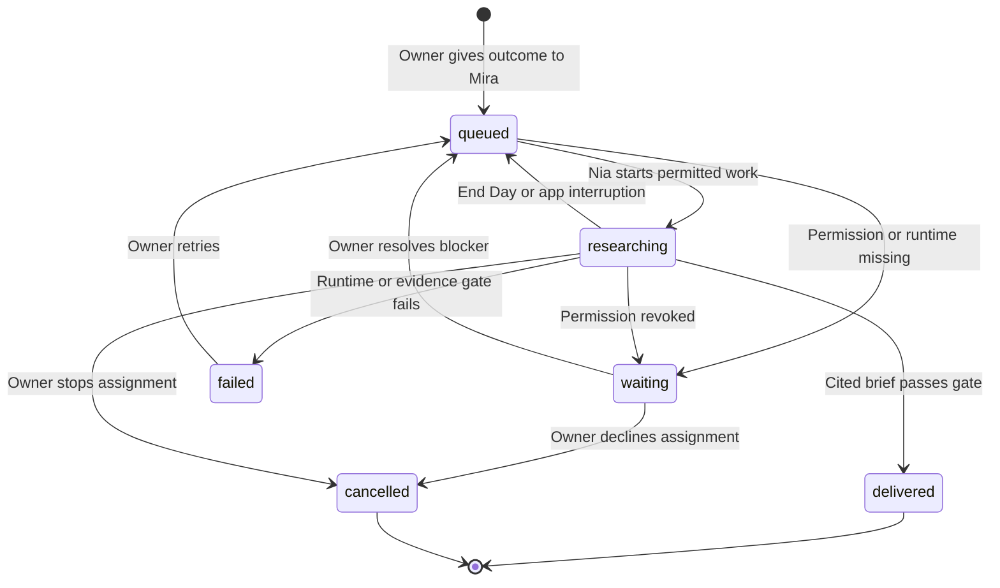

## Context

See `proposal.md` for motivation and
`specs/owner-directed-research/spec.md` for observable behavior. Agent Office
already has backward-compatible organization JSON, employee homes, artifact
storage, a bounded fixed content engine, a local Codex runner, explicit
`web-research` permission, and a paired owner assistant. The new path must reuse
those boundaries without teaching the fixed content engine to become a generic
workflow runtime.

## Goals / Non-Goals

**Goals:**

- Make one arbitrary research request useful through the current local app.
- Keep request, delegation, capability use, evidence, and delivery attributable
  and inspectable.
- Preserve one active execution boundary and truthful quit/reopen behavior.
- Reuse the established cozy visual language and existing employee identities.

**Non-Goals:**

- Multiple concurrent assignments, generic task graphs, recurring schedules,
  background execution while closed, chat, publishing, or external writes.
- A new model provider, research API, browser automation, Composio connection,
  credential store, or general permission engine.
- Changing the fixed content workday or the rejected character-art direction.

## Decisions

### Store a small research assignment state machine beside organizational knowledge

Add a backward-compatible `ResearchAssignment` record with one of `queued`,
`waiting`, `researching`, `delivered`, `failed`, or `cancelled`, plus explicit owner,
delegator, assignee, artifact, evidence, blocker, and timestamp fields. Store
the collection in `OrganizationKnowledge`, where older JSON already receives
default values through custom decoding. The POC admits only one non-terminal
assignment.

Alternative considered: dynamically add the assignment to the existing fixed
content `WorkTask` graph. Rejected because `WorkdayEngine` encodes article
dependencies and review behavior; mixing arbitrary research into that graph
would be the beginning of the generic workflow engine explicitly out of scope.

### Give owner-directed research its own bounded engine

Add a focused `ResearchAssignmentEngine` that accepts one assignment, one
`EmployeeRunner`, and the existing local store. It updates employee and
assignment state, invokes Nia once, verifies evidence, writes a brief, derives
one grounded Mira delivery note, and returns the office to rest. AppModel keeps
the existing single cancellable task/session boundary so End Day remains the
universal stop control.

Alternative considered: reuse the whole workday loop and generate temporary
tasks. Rejected because one invocation plus one evidence gate is enough for the
first research employee and is easier to make idempotent.

### Reuse the employee runner but distinguish assignment prompts

Represent the assignment as a synthetic research `WorkTask` passed through the
existing `EmployeeWorkRequest`. A stable assignment task-id prefix selects a
specific deterministic rehearsal and makes the Local Codex prompt request a
cited research brief with findings, uncertainty, and next actions. Assigned
organizational skills and Nia's durable memory remain in the prompt.

Alternative considered: add a second executor protocol. Rejected because the
security boundary and output shape are already correct; the behavioral
difference belongs in the request and verifier.

### Verify source presence before researched completion

For a permitted Local Codex run, require at least one structurally valid
HTTP(S) source reference inside its Sources section before writing a successful
brief and delivery note.
Demo output uses `synthetic-demo` and is presented as a rehearsal. Missing
sources or runner errors enter a recoverable failed state and never create a
successful owner delivery.

Alternative considered: trust a successful Codex process. Rejected because
process success does not prove the research objective or evidence contract.

### Project assignments and deliveries as ordinary files

Keep JSON canonical, generate root `RESEARCH_ASSIGNMENTS.md`, and write brief
and delivery artifacts through the existing store. On load, a persisted
`researching` assignment is reset to `queued`, employees return to rest, and
successful artifact identifiers remain unchanged.

Alternative considered: resume the exact process. Rejected because Codex runs
are ephemeral today; truthful task-level retry is the smallest reliable resume
semantic.

### Add one preserve-lane research desk to the existing folio

Add an “Ask Nia” entry point, a focused assignment sheet, and one stateful
research card above the fixed outcome ledger. The card shows
`You → Mira → Nia`, evidence basis, blocker/retry controls, and reveal actions.
It uses paper, spruce, apricot, rounded system type, native focus, and existing
employee portraits. No new navigation system or control-plane screen is added.

### Publish start state and keep AppModel authoritative over terminal saves

Transition the published organization to `researching` before awaiting the
employee runner. Persist that start before work begins, then accept and publish
the terminal engine result only after the current session still matches and a
final organization save succeeds. The engine writes ordinary artifact files,
but it does not independently replace terminal organization state. Revocation,
End Day, and explicit Stop invalidate the session so a stale captured run
cannot restore permissions or claim delivery.

Alternative considered: let the engine own every save and replace AppModel's
state when it returns. Rejected because permission changes and owner stops can
occur while the runner is suspended, making the captured state stale.

## Risks / Trade-offs

- **[A broad request produces a shallow brief]** → Keep the outcome and context
  visible, include Nia's research skill, and verify evidence without claiming
  general research quality.
- **[Source URL presence is a weak quality gate]** → Treat it as the first
  externally testable minimum; later skills can add source diversity and claim
  verification without changing assignment lifecycle.
- **[Cancellation races with a completed process]** → Guard state replacement
  with a session id and assignment id, and write successful artifacts only once.
- **[The folio becomes crowded]** → Show one current/latest assignment and keep
  history in the local projection; do not add a new dashboard.
- **[Demo mode is mistaken for research]** → Use explicit `synthetic-demo`
  evidence language in the card, brief, delivery, and activity.

## Migration Plan

1. Add assignment arrays with empty defaults and raise the local schema version.
2. On load, convert only in-flight `researching` assignments to resumable
   `queued`; preserve terminal assignments and all existing work.
3. Generate the new assignment projection after every save.
4. Rollback remains compatible because older decoders ignore the optional
   knowledge addition and ordinary artifact files are harmless.
