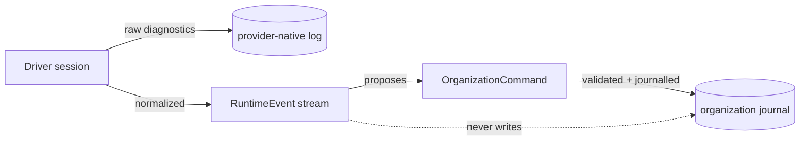

## Context

Runtime choice today is one line at the call site:

```swift
if provider == .localCodex, let codex = CodexEmployeeRunner.discover() {
  runner = codex
} else {
  runner = DeterministicEmployeeRunner()
}
```

`EmployeeRunner` has a single `perform` method. There is no driver identity,
version, health, configuration, session, or resumption — and no way for a
missing runtime to be represented as anything other than "fall back to the demo
runner", which silently substitutes synthetic work for real work.

## Goals / Non-goals

**Goals**
- A contract an unknown driver can implement.
- Driver failure that is visible, named, and isolated to the affected employee.
- Runtime evidence that is structurally separate from organization truth.

**Non-goals**
- Enforcing what a runtime may do. That is #26; this change deliberately grants
  no new authority and registers no new provider.
- Replacing `EmployeeRunner`. It becomes an implementation detail of the two
  built-in drivers.

## Decisions

### The driver contract wraps sessions, not calls

A driver creates a `RuntimeSession` for one employee, binding, and commitment.
The session runs turns and emits events. Modelling the session — rather than a
bare `perform` call — is what makes interruption, resumption cursors, and
per-session event correlation expressible at all.

### Availability is asked, not assumed

`availability()` is part of the contract, and the registry resolves a binding to
either a live driver or an `unavailable` shadow carrying a reason. The current
silent fallback to the demo runner is the specific behaviour this replaces: an
owner who thinks Codex ran deserves to be told it did not.

### Configuration holds secret references only

`RuntimeConfigurationValue` is either `.literal` or `.secretReference`. A driver
declares which fields are secret, and validation rejects a literal in a secret
field. Nothing in this change reads a secret; connection setup remains an owner
handoff, and #26 owns credential-adjacent policy.

### Runtime events are evidence, not history

`RuntimeEvent` is normalized and correlated, but it is not organization history.
Only #23's journal is authoritative. A session that wants to change the
organization returns a *proposed command* which the caller submits through the
#23 boundary, where it is validated and journalled like any other command.



### Bindings live in organization knowledge

A binding is durable organization data — it survives restarts and is inspectable
— so it belongs beside the other knowledge collections rather than in a separate
store. It is decoded permissively: an organization written before this change
loads with no bindings and derives a default binding from its existing execution
provider.

## Risks / Trade-offs

- **Two ways to run work during the transition.** The drivers wrap the existing
  runners rather than reimplementing them, so behaviour is unchanged, but
  `EmployeeRunner` remains reachable directly until later slices remove the last
  call sites. Recorded rather than hidden.
- **Event volume.** Normalized events are held per session and not yet
  persisted; persistence and retention belong with #23's later slices.
- **Capability negotiation is only as honest as the driver.** A driver that
  declares a capability it lacks fails at use. #26's broker is what makes a
  false declaration harmless rather than dangerous.
