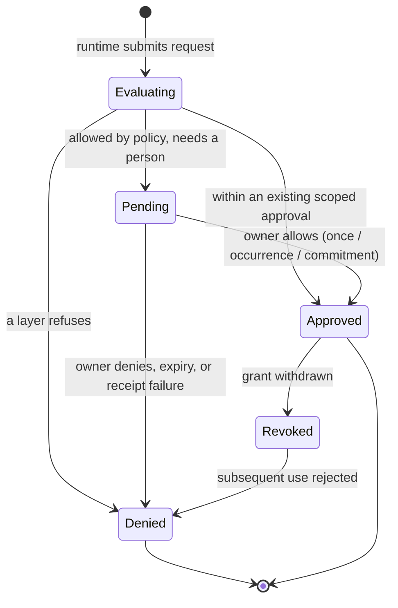

## Context

#25 gave Office OS a driver contract, so unknown agent software can be employed.
Nothing yet stops that software from asking for — and getting — more than the
employee's authority. The existing authority model is real and durable: package
boundaries, working contracts with capability grants and a review policy,
organization-level grants on the employee, and commitment scope. What is missing
is a single point where all of those are intersected and enforced before a
runtime acts.

## Goals / Non-goals

**Goals**
- One enforcement point, not a second permission model.
- Deny by default, with a reason a person can read.
- Approval scopes with genuinely different lifetimes.
- Provider suggestions that can never become policy.

**Non-goals**
- Adding credentials, connectors, or any external capability to grant.
- Owning durable authority. Contracts and grants stay authoritative; the broker
  reads them and records receipts.

## Decisions

### Authority is an intersection, evaluated in a fixed order

Runtime support → package boundaries → working contract scope → organization
grant → commitment scope → review policy. The first failing layer denies and
names itself. Ordering is fixed so a denial reason is stable and testable, and
so a broader layer can never mask a narrower one.

### The broker stores approvals, never grants

An approval is scoped to a single use, an occurrence, or a commitment, and dies
with it. Creating or widening a durable grant remains an owner action through
the existing contract-revision flow. This is what makes a provider's
"always allow" harmless: it is recorded as a suggestion and ignored as policy.

### Fail closed means the recorder decides

Resolutions are only honoured once their receipt is recorded through the #23
boundary. If recording fails, the request is denied and no approval is stored.
That makes "the broker is unavailable" and "the answer was lost" the same,
safe, outcome rather than two different partial states.

### Sanitization happens on the way in

Secret-shaped content is redacted when a request is built, not when it is
displayed, so a credential cannot leak into a receipt that was written before
anyone rendered it.

## Risks / Trade-offs

- **A denial can stall useful work.** That is the intended trade: an unanswered
  consequential question blocks rather than proceeds on a guess.
- **Approval lifetimes are only as meaningful as commitment and occurrence
  state.** The broker asks the organization for that state on every check rather
  than caching it, so a finished commitment cannot keep an approval alive.
- **In-memory approvals.** Scoped approvals are deliberately not persisted:
  restarting the app should not silently retain permission. Receipts of what was
  decided are persisted through #23.
