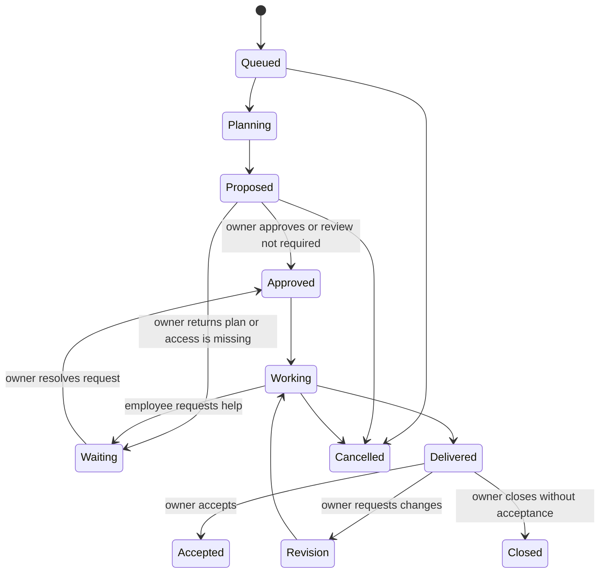
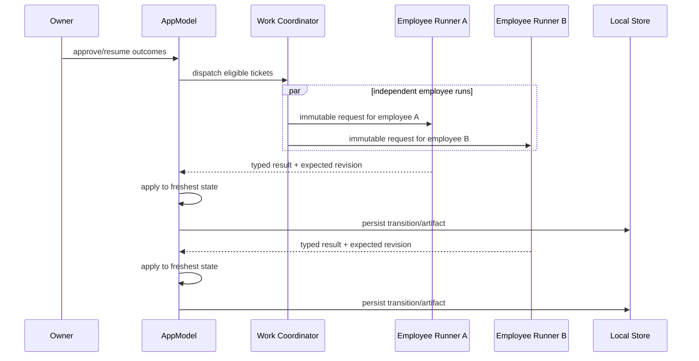

## Context

See `proposal.md` for motivation. The current POC has durable seeded employees, versioned organizational skills, a small connection catalogue, employee homes, one generic outcome engine, separate research and recurring-duty engines, and a single `AppModel.workTask` that serializes all execution. Employee identity already survives switching the organization between Demo and Local Codex, but employment state, package provenance, execution configuration, plan review, acceptance, and per-employee queues are not represented.

The implementation must remain native SwiftUI/SpriteKit with Foundation persistence, preserve older local organizations, keep employee execution beneath the selected organization directory, avoid credentials and new dependencies, and remain inspectable without a working model runtime.

## Goals / Non-Goals

**Goals:**

- Establish one coherent data model for employable packages, hired employees, working contracts, outcomes, supervision, and local runs.
- Make every special-purpose work source create or adapt into the canonical employee-owned outcome path.
- Support independent per-employee queues and bounded concurrency without allowing stale state snapshots to overwrite one another.
- Preserve the Editorial Office visual language while making hiring and management primary.
- Migrate existing organizations without losing identity, work, duties, research, artifacts, or activity.

**Non-Goals:**

- A remote marketplace, payments, subscriptions, licensing enforcement, or automatic package downloads.
- Credential storage, arbitrary external writes, publishing, cloud scheduling, or work while the app is closed.
- A visual workflow builder, arbitrary executable package code, or package-provided Swift modules.
- Unlimited parallelism or more than one active model invocation per employee.

## Decisions

### 1. Employee packages are declarative data, not executable plugins

An `EmployeePackage` is Codable data with package/version/creator metadata, a candidate identity, role and responsibility, included skill definitions, required connection identifiers, an execution requirement, default boundaries, and optional reduced-mode language. Built-in starter packages ship as code-created records; imported JSON packages are copied into the organization's `employee-packages/` catalogue.

Hiring creates a new `Employee` plus a `WorkingContract` referencing the package and copies package skills into the organization's existing versioned skill catalogue. It does not execute package code, import credentials, or grant connections.

Alternative considered: load executable Swift bundles or MCP servers from packages. Rejected because it would collapse employee identity, skills, and tools into unreviewable code and violate the local POC security boundary.

### 2. Employment state and work status remain separate

`Employee` gains package provenance and an `EmploymentState` (`candidate`, `hired`, `paused`, `retired`). Existing human members migrate as hired organization members without package provenance. Existing AI employees migrate as hired instances of matching built-in starter packages. `EmployeeStatus` continues to describe presence and current work only.

Pausing cancels only that employee's active run and prevents queue dispatch. Retirement requires no active run, preserves all history, and removes the person from active Office and assignment pickers.

Alternative considered: infer employment from whether an employee appears in the roster. Rejected because pause, retirement, historical attribution, and available candidates would remain ambiguous.

### 3. Working contracts are organization-owned overlays

Each hired AI employee receives a `WorkingContract` keyed by employee ID. It records package version, contract revision, role/responsibility overrides, relationships, assigned skill IDs, declared tool/connection IDs, capability grants, execution provider, optional model name, environment kind, workspace path, autonomy boundaries, and provenance for overridden values.

Existing `Employee.role`, `responsibility`, `managerID`, skill assignments, and capability grants remain compatibility projections during migration. Contract mutation updates those projections transactionally so older surfaces and files stay truthful while the new UI reads the contract directly.

Alternative considered: move all fields off `Employee` immediately. Rejected because it would turn a broad behavior change into a destructive persistence rewrite and make rollback unsafe.

### 4. EmployeeOutcome becomes the canonical commitment

`EmployeeOutcome` expands to include acceptance criteria, priority, queue position, source (`owner`, `recurringResponsibility`, `legacyResearch`, or `legacyWorkday`), plan status, accountable employee, ticket delegation, revision history, management messages, delivery, and acceptance. Its state machine becomes:

Research assignments and duty occurrences retain compatibility identifiers but point to generated outcome IDs. Their existing views become thin templates/history views and no longer invoke independent execution engines after migration. The fixed first content workday becomes a prepared multi-employee outcome template rather than a privileged engine.

Alternative considered: keep each engine and merely aggregate them in the UI. Rejected because that preserves the ontology problem and blocks generic management.

### 5. Supervision is a persisted conversation of decisions, not chat

`SupervisionEvent` records request/decision kind, actor, employee, outcome/ticket, message, structured action, prior value where relevant, and time. Pending inbox items are derived from candidate state, proposed plans, unresolved employee requests, delivered outcomes, and contract changes rather than copied into a second mutable queue.

Owner replies are attached to the affected outcome or ticket. Plan edits operate only before execution; redirect and reassignment operate only on unfinished tickets; delivery revisions append a bounded revision ticket and preserve prior artifacts.

Alternative considered: add a general employee chat. Rejected because raw conversation is not the durable management object and would recreate prompt-driven interaction.

### 6. Concurrent execution uses event application against fresh state

The current engines return a complete mutated `OrganizationState`, which is unsafe when two asynchronous runs begin from different snapshots. The new `EmployeeWorkCoordinator` owns at most one `Task` per employee and starts work up to `organizationConcurrencyLimit` (default 2 for the POC). A run performs one model operation at a time and returns a typed `EmployeeRunResult`. `AppModel`, isolated on the main actor, applies each result to the latest organization state, validates the expected outcome/ticket revision, writes artifacts, persists, then dispatches the next eligible work.

Stopping one employee cancels only that task. On reopen, persisted `planning` or `working` tickets become resumable independently. Completed artifacts remain idempotent by stable ticket artifact ID.

Alternative considered: run existing whole-state engines concurrently and merge arrays after completion. Rejected because concurrent edits to queues, blockers, contracts, and activity cannot be merged safely by identifier alone.

### 7. Delegation is ticket assignment constrained by contracts

The accountable employee remains `EmployeeOutcome.assigneeID`. A proposed ticket may name another hired employee as `WorkTask.assigneeID` plus an explicit `accountableEmployeeID` and delegation reason. Validation requires the delegate to be hired, unpaused, and assigned every skill required by the ticket; capability checks occur again at execution time.

The first implementation permits delegation only during plan proposal or owner reassignment, not recursive employee-created sub-outcomes. This provides real teamwork without an unbounded orchestration graph.

Alternative considered: allow agents to hire agents or create arbitrary sub-agents. Rejected because hiring is an owner decision and recursive delegation would obscure accountability.

### 8. The UI remains a preserve-lane extension

The Editorial Office remains authoritative. Onboarding's Team step becomes an explicit starter-team hiring review. Company Library Employees gains Available, Employed, and History groups plus Import Package. Employee folios show the current commitment and valid management action. Employee Details leads with the employee's real commitment and adds a Working Contract section. Mission groups canonical outcomes and tickets and provides the contextual supervision actions. The Office owner tray becomes the management inbox.

No new global destination, dashboard shell, workflow builder, or visual language is introduced. At compact widths, candidate and contract folios stack vertically instead of introducing horizontal canvases.

### 9. Migration is additive and compatibility-first

The schema version increases once for the complete change. Migration will:

1. Install built-in starter packages idempotently.
2. Mark existing human and AI members hired; link known AI employees to starter packages.
3. Create working contracts from existing roles, responsibilities, relationships, skill assignments, grants, organization execution mode, and employee homes.
4. Add acceptance, priority, plan, and source defaults to existing generic outcomes.
5. Link legacy research assignments and duty occurrences to canonical outcomes without deleting their prior records or artifacts.
6. Convert interrupted per-engine state into independently resumable outcomes.
7. Continue writing existing Markdown projections plus new `WORKING_CONTRACT.md`, package, supervision, and queue projections.

Rollback is data-preserving: older code may ignore additive fields and continue reading compatibility projections. New outcomes created after migration are not guaranteed to execute in older code, but their JSON and artifacts remain intact.

## Risks / Trade-offs

- **[Concurrency introduces state races]** → Apply typed results only on the main actor against expected revisions and persist each transition before dispatching more work.
- **[Scope is too large for one undifferentiated rewrite]** → Implement in vertical milestones while keeping one schema and one canonical model; preserve adapters until their replacement tests pass.
- **[Package imports become an unsafe plugin system]** → Accept declarative JSON only, reject secret-shaped values and executable paths, and never auto-grant connections.
- **[Plan review slows simple work]** → Working contracts carry a review policy; safe local outcomes may auto-approve while new employees, delegation, missing access, or external capabilities require review.
- **[The management inbox becomes another dashboard]** → Derive it from employee commitments and keep actions inside folios and Mission inspectors in the existing workplace language.
- **[Legacy screenshots and special views drift]** → Replace entry points only after canonical outcome parity is covered, then capture fresh normal and compact native evidence.
- **[Retirement breaks attribution]** → Never delete employee records referenced by work; filter by employment state for active surfaces.

## Migration Plan

1. Add backward-compatible package, employment, contract, expanded outcome, supervision, and run-state models with migration tests.
2. Seed/import packages and implement hire, pause, resume, retire, and contract projections while existing work engines remain functional.
3. Expand the outcome state machine and supervision actions; route new generic work through it.
4. Introduce the event-based coordinator and per-employee queues; keep the organization concurrency limit at two until stress tests pass.
5. Adapt research, recurring duty, and prepared content work into canonical outcomes, preserving legacy IDs and history.
6. Replace UI entry points with hiring, working-contract, unified Mission, and contextual management surfaces.
7. Remove unreachable special-purpose execution code only after migrations, tests, and native evidence prove parity.

