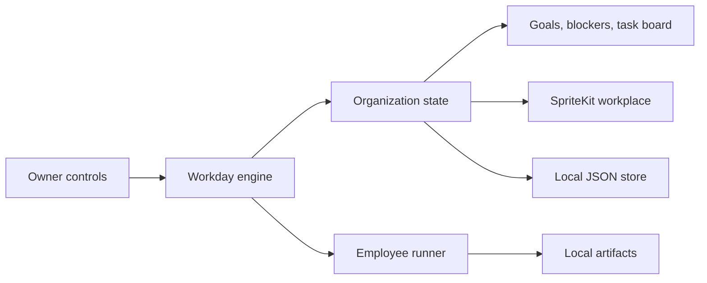

## Context

See `proposal.md` for motivation and the three capability specs for observable
behavior. This is a new standalone native product with no legacy code, product
name, backend, deployment, or third-party dependency. The POC must establish a
real employee-work loop without building the future permission and integration
platform.

## Goals / Non-Goals

**Goals:**

- Produce a runnable native Mac application with a truthful living workplace.
- Keep organization state and artifacts local, inspectable, and resumable.
- Demonstrate bounded researcher-writer-manager coordination.
- Preserve seams for human employees, different models, separate machines,
  skills, permissions, and integrations without implementing them.

**Non-Goals:**

- Background hourly scheduling while the app is closed.
- Publishing, cloud access, browsers, computer use, GCP, Composio, or secrets.
- A generic workflow engine, permission system, agent marketplace, or HR suite.
- A general-purpose map editor, networked multiplayer simulation, or production
  app bundle.

## Decisions

### Build a native SwiftUI shell with a SpriteKit workplace

SwiftUI provides the Mac window, sidebar, inspectors, accessibility, settings,
and file actions. SpriteKit provides a real-time 2D scene with characters,
layering, and movement without adding a dependency. A Tauri/React/Pixi stack
would make AI Town code reuse easier but adds a web runtime and production
dependencies before the native product interaction has been proven.

### Adapt AI Town's simulation primitives, not its stack or assets

The SpriteKit scene gives each employee a persistent position, a meaningful
destination, a waypoint route, facing, and a movement state. Authored walkable
lanes connect workstations and meeting points. Employees replan around occupied
destinations, walk to task-derived stations, and use bounded idle paths only
when no consequential work is active. This keeps the room visibly alive while
ensuring animation remains evidence of real work. AI Town is an architectural
and quality reference; no web runtime or borrowed art is required.

### Onboard through the first real workday

First launch presents a short native setup journey: name the organization,
state its first outcome, meet the starter team, and enter the office. Setup is
skippable and writes the same local organization used by the product rather
than creating a disposable tutorial. The completion moment begins the first
workday so the employees walk into the room and take up real assignments.

### Separate the domain model from the scene

`OrganizationState` is the single source of truth. The workplace observes
employee and task state and maps it to positions and animation; it never owns
task progress. This prevents attractive but fictitious agent activity and lets
future human or headless clients share the same organization model.

### Use a deterministic runner and an optional Codex runner

`EmployeeRunner` returns structured work results. The deterministic runner
makes the POC demonstrable and testable without consuming model usage. The
Codex runner invokes `codex exec` with an ephemeral session, read-only sandbox,
employee-local working directory, and last-message output, then lets the app
write the returned artifact. The app stores no API credential. App Server is a
future replacement once multi-turn employee sessions are needed.

### Advance one visible work step at a time

Start Day begins a cancellable asynchronous loop. Each step claims one eligible
task, changes the employee's visible state, produces or reviews an artifact,
persists, then yields briefly so the owner can understand progress. End Day
cancels before the next step and persists a resting organization.

The scene animates those state transitions independently from the work engine.
Travel is interruptible: a new task, blocker, handoff, End Day, or Reduce Motion
preference replaces the old route rather than waiting for a decorative
animation to finish.

### Store one JSON snapshot plus ordinary artifacts

The organization directory contains `organization.json` and employee-owned
Markdown files beneath `employees/<employee-id>/`. Atomic snapshot replacement
is sufficient for one local process. An event ledger and concurrent merge
rules are intentionally deferred until more than one process can mutate state.

### Preserve future authority without implementing permissions

Employee records include stable identity and an empty capability-grant list.
Actions and artifacts are attributed. No POC action is authorized beyond the
selected local organization directory, so a policy engine would add ceremony
without improving current safety.

## Risks / Trade-offs

- **A deterministic demo could look like fake autonomy** → Label Demo and Local
  Codex modes clearly and make every artifact inspectable.
- **Subprocess execution can fail or outlive UI state** → Use cancellation,
  capture errors as blockers, and persist before and after each step.
- **Programmatic art can fall below the AI Town quality bar** → Establish the
  visual world in `DESIGN.md`, use authored native shapes and texture, and keep
  the POC honest about later sprite-production work.
- **One JSON snapshot cannot support concurrent actors** → Restrict the POC to
  one app process and keep persistence behind an actor.
- **A game scene can obscure work** → Maintain parallel native goals,
  blockers, tasks, and employee details with keyboard access.

## Migration Plan

No deployment or data migration is required. Build and run locally. Deleting
the app does not remove a user-selected organization folder. The working
directory and display name can be renamed once the product name is chosen.
